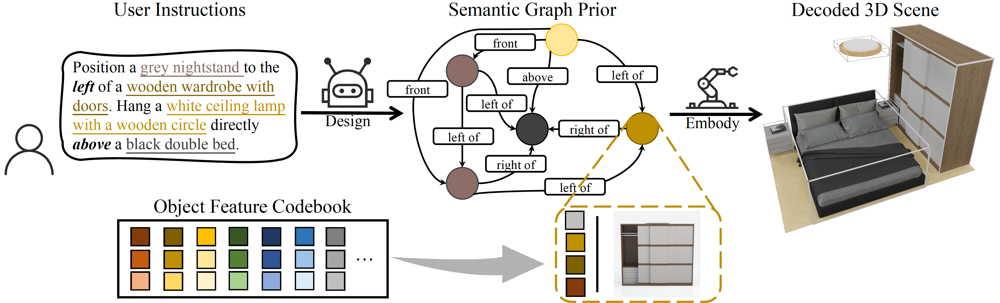

# [ICLR 2024 spotlight] InstructScene

<h4 align="center">

InstructScene: Instruction-Driven 3D Indoor Scene Synthesis with Semantic Graph Prior

[Chenguo Lin](https://chenguolin.github.io), [Yadong Mu](http://www.muyadong.com)

[](https://arxiv.org/abs/2402.04717)
[](https://chenguolin.github.io/projects/InstructScene)
[](https://huggingface.co/datasets/chenguolin/InstructScene_dataset)

<p>
    
    
    
</p>

<p>
    
</p>

</h4>

This repository contains the official implementation of the paper: [InstructScene: Instruction-Driven 3D Indoor Scene Synthesis with Semantic Graph Prior](https://arxiv.org/abs/2402.04717), which is accepted to ICLR 2024 for spotlight presentation.
InstructScene is a generative framework to synthesize 3D indoor scenes from instructions. It is composed of a semantic graph prior and a layout decoder.

Feel free to contact me (chenguolin@stu.pku.edu.cn) or open an issue if you have any questions or suggestions.


## 🔥 See Also

You may also be interested in our other works:
- [**[arXiv 2506] PartCrafter**](https://wgsxm.github.io/projects/partcrafter): a 3D-native DiT that can directly generate 3D scenes from a single image with multiple objects.
- [**[ICLR 2025] DiffSplat**](https://github.com/chenguolin/DiffSplat): generates individual 3D objects that can replace the retrieving operation in InstructScene.
- [**[arXiv 2407] InstructLayout**](https://arxiv.org/abs/2407.07580): extends InstructScene to generate 2D layouts from instructions.


## 📢 News

- **2024-07-11**: Unofficial pretrained parameters of two-stage generative models are provided by [@arjuntheprogrammer](https://github.com/arjuntheprogrammer). Thank you very much! Please see [issue#9](https://github.com/chenguolin/InstructScene/issues/9) for more information.
- **2024-04-12**: Script for caption refinement by OpenAI ChatGPT is uploaded (sorry for the late update).
- **2024-02-28**: The pretrained weights of fVQ-VAE are released.
- **2024-02-28**: The source code and preprocessed dataset are released.
- **2024-02-07**: The paper is available on arXiv.
- **2024-01-16**: InstructScene is accepted to ICLR 2024 for spotlight presentation.


## 📋 TODO

- [x] Release the training and evaluation code.
- [x] Release the preprocessed dataset and rendered images on HuggingFace.
- [x] Release the pretrained weights of fVQ-VAE to quantize OpenShape features of 3D-FRONT objects.
- [x] Release the script for caption refinement by OpenAI ChatGPT.


## 🔧 Installation

You may need to modify the specific version of `torch` in `settings/setup.sh` according to your CUDA version.
There are not restrictions on the `torch` version, feel free to use your preferred one.
```bash
git clone https://github.com/chenguolin/InstructScene.git
cd InstructScene
bash settings/setup.sh
```

Download the Blender software for visualization.
```bash
cd blender
wget https://download.blender.org/release/Blender3.3/blender-3.3.1-linux-x64.tar.xz
tar -xvf blender-3.3.1-linux-x64.tar.xz
rm blender-3.3.1-linux-x64.tar.xz
```


## 📊 Dataset

Dataset used in InstructScene is based on [3D-FORNT](https://tianchi.aliyun.com/specials/promotion/alibaba-3d-scene-dataset) and [3D-FUTURE](https://tianchi.aliyun.com/specials/promotion/alibaba-3d-future).
Please refer to the instructions provided in their [official website](https://tianchi.aliyun.com/dataset/65347) to download the original dataset.
One can refer to the dataset preprocessing scripts in [ATISS](https://github.com/nv-tlabs/ATISS?tab=readme-ov-file#dataset) and [DiffuScene](https://github.com/tangjiapeng/DiffuScene?tab=readme-ov-file#dataset), which are similar to ours.

We provide the preprocessed instruction-scene paired dataset used in the paper and rendered images for evaluation on [HuggingFace](https://huggingface.co/datasets/chenguolin/InstructScene_dataset).
```python
import os
from huggingface_hub import hf_hub_url
url = hf_hub_url(repo_id="chenguolin/InstructScene_dataset", filename="InstructScene.zip", repo_type="dataset")
os.system(f"wget {url} && unzip InstructScene.zip")
url = hf_hub_url(repo_id="chenguolin/InstructScene_dataset", filename="3D-FRONT.zip", repo_type="dataset")
os.system(f"wget {url} && unzip 3D-FRONT.zip")
```

Please refer to [dataset/README.md](./dataset/README.md) for more details.


## 👀 Visualization

We provide a helpful script to visualize synthesized scenes by [Blender](https://www.blender.org/).
Please refer to [blender/README.md](./blender/README.md) for more details.

We also provide many useful visualization functions in [src/utils/visualize.py](./src/utils/visualize.py), including creating appropriate floor plans, drawing scene graphs, adding instructions as titles in the rendered images, making gifs, etc.


## 🚀 Usage

Note that:

- All scripts in this project are executed in only one GPU. It takes 1~3 days to train the semantic graph prior or layout decoder on a single NVIDIA A40 GPU depending on the room type.

- We use `TensorBoard` to track the training process by executing `tensorboard --logdir out/`.

- The training of "1. layout decoder" and "2. semantic graph prior" are independent and can be trained parallelly, as we use ground-truth semantic graphs to train the layout decoder.
During inference, to render syntheiszed scenes from instruction prompts, one needs to have both the semantic graph prior and the layout decoder trained.

### 0️. 📦 fVQ-VAE: quantize OpenShape/CLIP features of objects

#### Training
We provide the pretrained weights of fVQ-VAE on [HuggingFace](https://huggingface.co/datasets/chenguolin/InstructScene_dataset). Our preprocessed dataset contains the original OpenShape features and **correspondingly quantization indices**.
```python
import os
from huggingface_hub import hf_hub_url
os.system("mkdir -p out/threedfront_objfeat_vqvae/checkpoints")
url = hf_hub_url(repo_id="chenguolin/InstructScene_dataset", filename="threedfront_objfeat_vqvae_epoch_01999.pth", repo_type="dataset")
os.system(f"wget {url} -O out/threedfront_objfeat_vqvae/checkpoints/epoch_01999.pth")
url = hf_hub_url(repo_id="chenguolin/InstructScene_dataset", filename="objfeat_bounds.pkl", repo_type="dataset")
os.system(f"wget {url} -O out/threedfront_objfeat_vqvae/objfeat_bounds.pkl")
```

You can also train the fVQ-VAE from scratch. However, you should **update the quantization indices in the dataset** (stored in `dataset/InstructScene/threed_front_<room_type>/<scene_id>/models_info.pkl`) accordingly.
```bash
# bash scripts/train_objfeatvqvae.sh <tag> <gpu_id>
bash scripts/train_objfeatvqvae.sh threedfront_objfeat_vqvae 0
```

#### Inference (only for debugging)
```bash
# bash scripts/inference_objfeatvqvae.sh <tag> <gpu_id> <epoch>
bash scripts/inference_objfeatvqvae.sh threedfront_objfeat_vqvae 0 -1
# '-1' means the latest checkpoint
```

### 1️. 🦾 Layout Decoder: embody 3D scenes from semantic graphs

#### Training
```bash
# bash scripts/train_sg2sc_objfeat.sh <room_type> <tag> <gpu_id> <fvqvae_tag>
bash scripts/train_sg2sc_objfeat.sh bedroom bedroom_sg2scdiffusion_objfeat 0 threedfront_objfeat_vqvae
```

#### Inference (only for debugging)
```bash
# bash scripts/inference_sg2sc_objfeat.sh <room_type> <tag> <gpu_id> <epoch> <fvqvae_tag> <(optional) cfg_scale>
bash scripts/inference_sg2sc_objfeat.sh bedroom bedroom_sg2scdiffusion_objfeat 0 -1 threedfront_objfeat_vqvae 1.0
```

To visualize synthesized scenes, replace `--n_scene 0` in `scripts/inference_sg2sc_objfeat.sh` to `--n_scenes 5 --visualize --resolution 1024`, which means to visualize 5 synthesized scenes and save the rendered images with a resolution of 1024x1024.
Otherwise, it will only compute the iRecall score for evaluation.

### 2️. 🤖 Semantic Graph Prior: design semantic graphs from instructions

#### Training
```bash
# bash scripts/train_sg_vq_objfeat.sh <room_type> <tag> <gpu_id>
bash scripts/train_sg_vq_objfeat.sh bedroom bedroom_sgdiffusion_vq_objfeat 0
```

#### Inference
```bash
# bash scripts/inference_sg_vq_objfeat.sh <room_type> <tag> <gpu_id> <epoch> <fvqvae_tag> <sg2sc_tag> <(optional) cfg_scale> <(optional) sg2sc_cfg_scale>
bash scripts/inference_sg_vq_objfeat.sh bedroom bedroom_sgdiffusion_vq_objfeat 0 -1 threedfront_objfeat_vqvae bedroom_sg2scdiffusion_objfeat 1.0 1.0
```

To visualize synthesized scenes, replace `--n_scene 0` in `scripts/inference_sg_vq_objfeat.sh` to `--n_scenes 5 --visualize --resolution 1024`, which means to visualize 5 synthesized scenes and save the rendered images with a resolution of 1024x1024.
Otherwise, it will only compute the iRecall score for evaluation.

#### Evaluation

Evaluation should be conducted after the inference script is executed with the `--visualize` flag, which will save the rendered images in the output directory.

##### FID, CLIP-FID and KID
```bash
python3 src/compute_fid_scores.py configs/bedroom_sgdiffusion_vq_objfeat.yaml --tag bedroom_sgdiffusion_vq_objfeat --checkpoint_epoch -1
```

##### SCA (scene classification accuracy)
```bash
python3 src/synthetic_vs_real_classifier.py configs/bedroom_sgdiffusion_vq_objfeat.yaml --tag bedroom_sgdiffusion_vq_objfeat --checkpoint_epoch -1
```

#### Applications
Replace the python file name in `scripts/inference_sg_vq_objfeat.sh` from `generate_sg.py` to `stylize_sg.py`, `rearrange_sg.py` or `complete_sg.py` for "stylization", "rearrangement" or "completion" downstream tasks, respectively.

Please refer to these python files for more detailed arguments and usage.


## 😊 Acknowledgement
We would like to thank the authors of [ATISS](https://github.com/nv-tlabs/ATISS), [DiffuScene](https://github.com/tangjiapeng/DiffuScene), [OpenShape](https://github.com/Colin97/OpenShape_code), [NAP](https://arxiv.org/abs/2305.16315) and [CLIPLayout](https://arxiv.org/abs/2303.03565) for their great work and generously providing source codes, which inspired our work and helped us a lot in the implementation.


## 📚 Citation
If you find our work helpful, please consider citing:
```bibtex
@inproceedings{lin2024instructscene,
  title={InstructScene: Instruction-Driven 3D Indoor Scene Synthesis with Semantic Graph Prior},
  author={Chenguo Lin and Yadong Mu},
  booktitle={International Conference on Learning Representations (ICLR)},
  year={2024}
}
```
